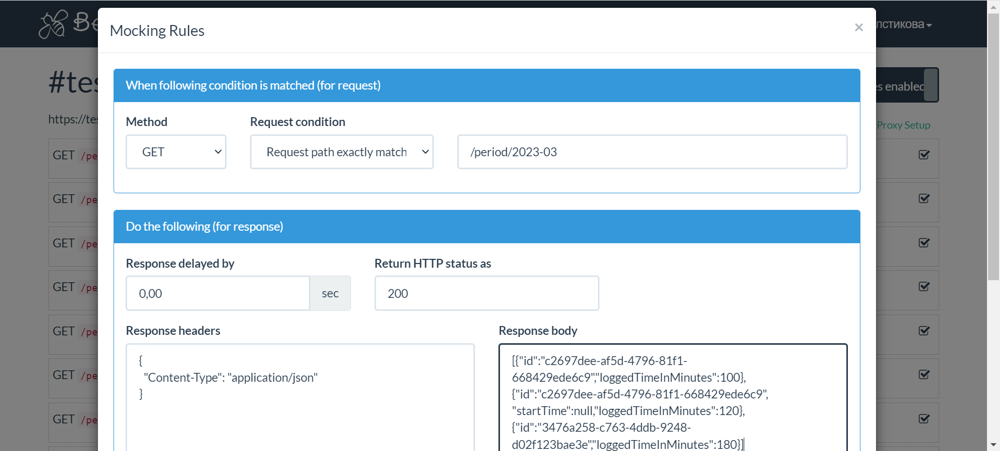
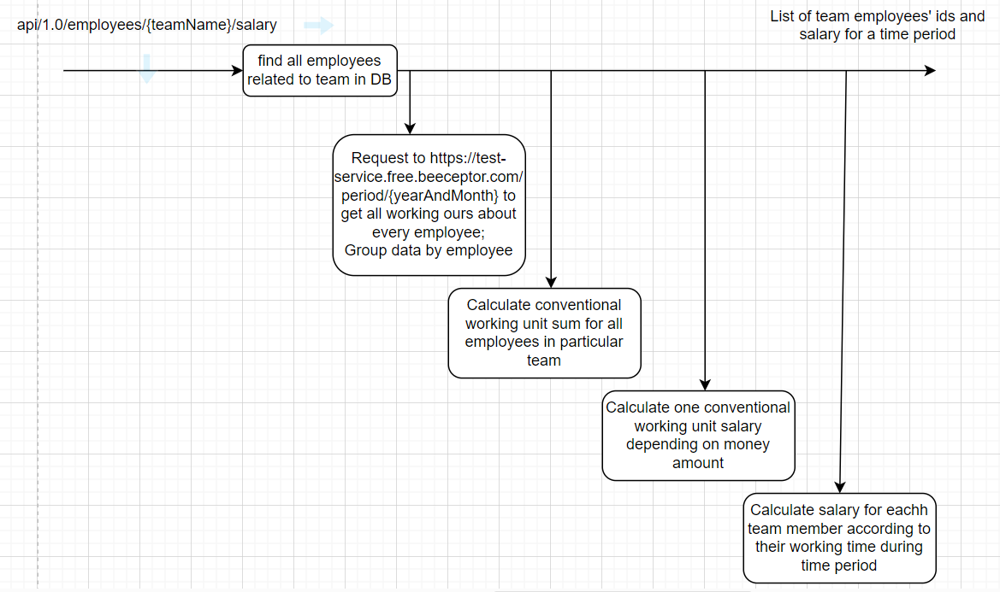

# About application

Application receives JSON from external service with information about every company's employee working time 
during a month and calculates a salary for employees related to a particular team 
depending on the working time in minutes and salary factor.

### Project stack
* Java 17
* Spring Boot 3
* Embedded H2 database
* Lombok
* WebClient

### Application run information
* When the application starts it fills db tables from file data.sql
* External service was mocked with [beeceptor.com](https://beeceptor.com/). To mock the service:
  * Create service with name "test-service" ("test-service.free.beeceptor.com")
  * Add rule GET /period/2023-03
  * Put Response Body from resources/workingHoursResponseMock.json

### Process diagram

